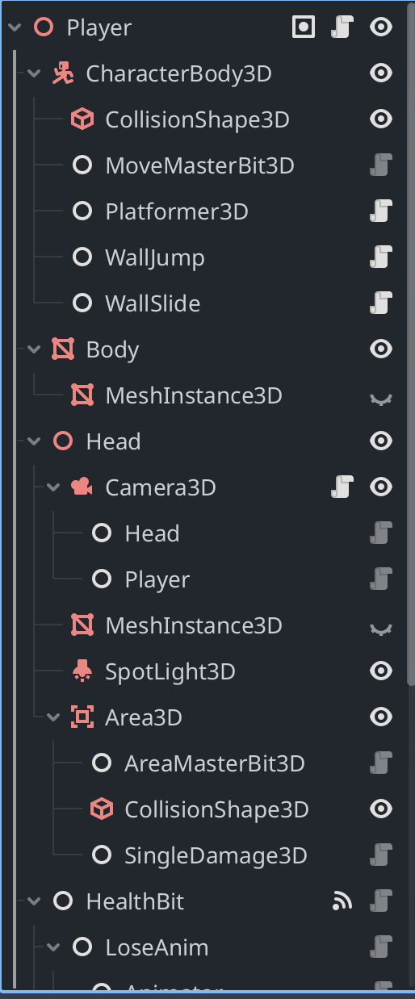
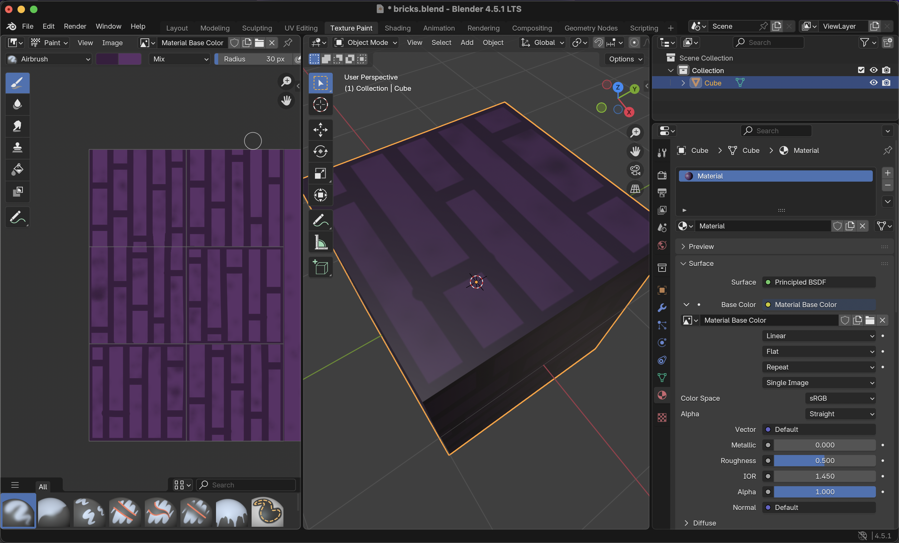
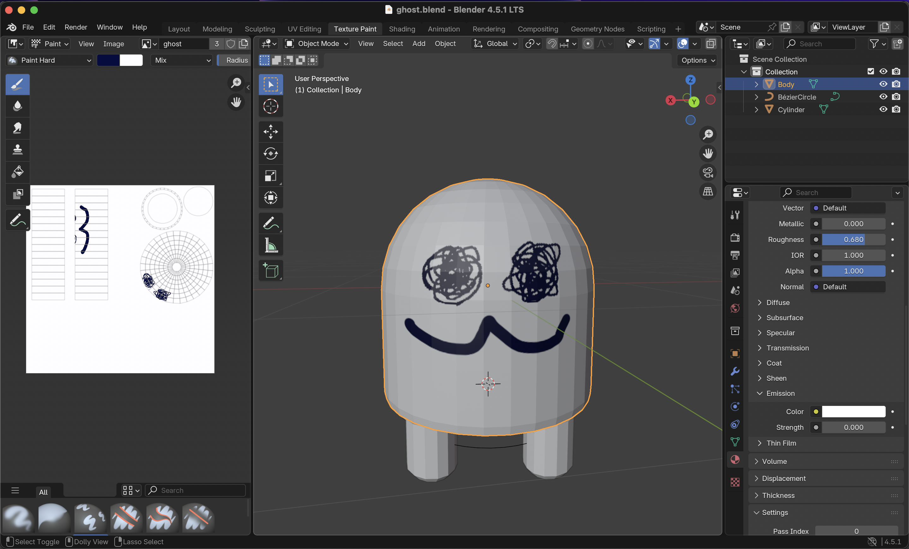

# Siege Week 5 -> Ghost Rush 3D
A game where you dodge and vanquish ghosts by looking at them. Made for Hackclub's Siege Week 5; the theme this week was Spooky,

---
## Controls
- W/S to move forwards and backwards
- A/D to strafe left and right
- Space to Jump
- Jump into a wall to run along it, jump while on a wall to launch off of it.
- Play on web [here](https://baton-0.itch.io/ghost-rush-3d)!

## Overview
- Made using a composition system. [What's that?](https://youtu.be/74y6zWZfQKk)
- The system had to be modified to do 3D stuff as well as 2D.
-  A section of the Player scene.
- This is my first solo 3D game, and it's a (much simpler) version of [Ghost Rush](https://baton-0.itch.io/ghost-rush) - I might make it a full 3D version in future weeks...

## Credits
- All assets, code, and everything else made by me! No credits this time.        

